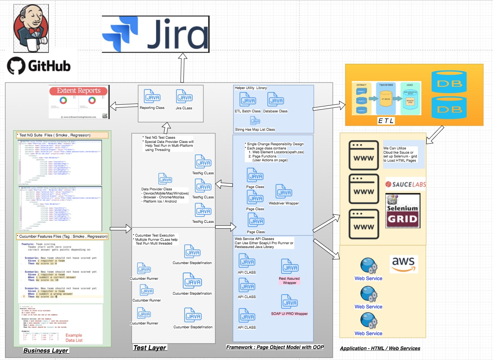
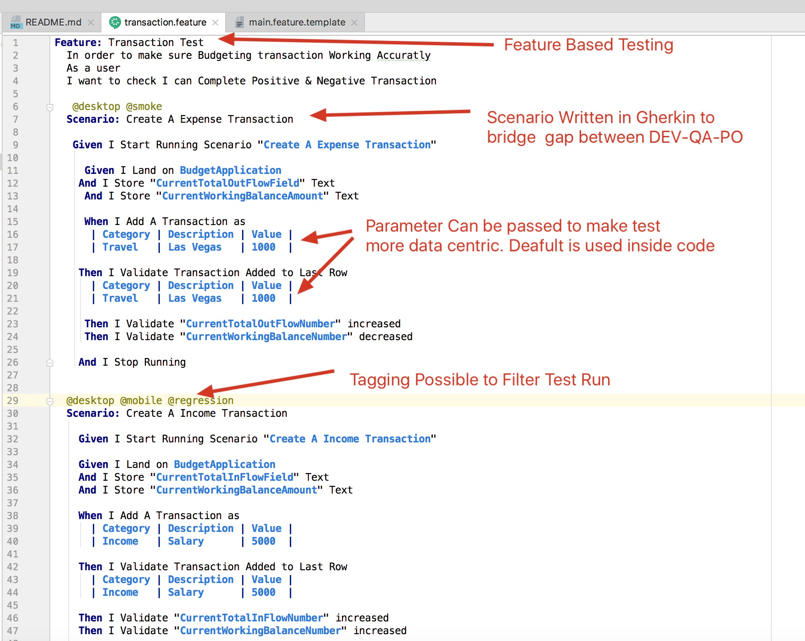
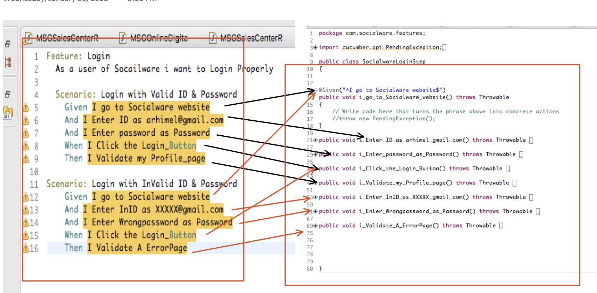
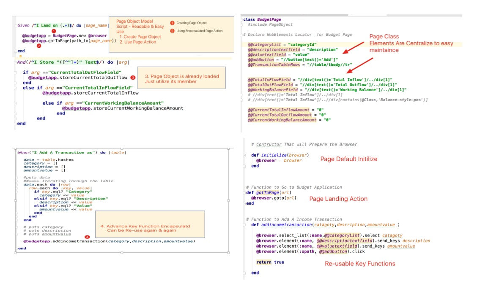

# All In One Test Automation Framework

# Introduction
Well come to All In One Test Automation Framework. This Framework Documentation will guide you through the Test & Test Automation Development Process for  
Any Web/Web-Service or Data Sensitive Application.  This Framework is designed such a way that 
 - It can reduce the gap between Business stakeholder PO/BA , developer & Technical Non-Technical QA in a Agile team.
 - Easily integrate acceptance test scenario written by BA or PO in Jira or other tools using BDD Gherkin Formate or TestNg Anooted Test Format
 - Easy Maintaince of Test Suite Like Regression / Smoke add hoc test 

## Technology Stack
The entire framework was built using latest and greatest open source tools and technology 

- [x] [Cucumber](https://cucumber.io/) => for batter functional ACCEPTANCE test. 
- [x] [Gherkin Syntax](https://docs.cucumber.io/gherkin/) =+> to make the test living documentation for the entire team
- [x] [TestNG](http://testng.org/doc/index.html) ==> to make Cross browser / Cross Device parallel test easy using @DATAPROVIDER mechanism  
- [x] [Java/JDK](http://www.oracle.com/technetwork/java/javase/downloads/jdk8-downloads-2133151.html) ==> to use the power of Object Oriented Programming, Page object Model Design Pattern
- [x] [Selenium](https://www.seleniumhq.org/) ==> for web browser based application. 
- [x] [rest-assured](http://rest-assured.io/) ==> for web-service API testing  
- [x] [Soap UI Test Runner ](https://www.soapui.org/test-automation/) ==> to run  the SOAPUI / Pro based  project if any
- [x] [Maven](https://maven.apache.org/plugins/maven-compiler-plugin/) ==> for Build & deployment with Depedency management

Additional Tools can be Used 
- [x] [applitools ](https://applitools.com/) ==> for Visual Testing 
- [x] [Appium ](http://appium.io/) ==> to hit the test in real mobile device 
- [x] [sitespeed ](https://www.sitespeed.io/) ==> for basic performence test on application

Test Automation High Level Overview 
==================================================

This is a test harness for automated functional testing of web applications, using the [Cucumber](http://cukes.info/) and [Selenium](http://watirwebdriver.com/) test frameworks. It can be used to support Behavioral Driven Design (BDD) or just automated functional testing of arbitrary web applications.

By using this collection of frameworks, you can quickly start a suite of functional tests for an application using a basic vocabulary inspired by tests that have been used successfully on many production projects.

The built in steps in `features/step-definitions/common_steps.java` cover a variety of common use cases that occur in the functional testing of web applications, including common operations such as visiting pages, filling in form fields, finding text in a page, and checking that operations complete successfully.

This approach might not be as pure as some would advocate for BDD, but it strikes a good balance between being implementation specific and being fast to write and execute.

Here is an example of a Cucumber scenario written with the common steps:

Cucumber Need a Mapping with feature files all Steps to one java function that can be create very easyly

framework is scripted as Page Objct Model patterns. So automation engineers Can Quickly pick an existing page object 
and utilize the encapsulated Code Behind the page class

Have look on POM Structure:

### Installing & Executing the Program

* Clone the git-hub repo to any machine that has maven installed
* Open terminal in mac or CMD in windows
* CD to the project Directory
* run this below command to start the program
* mvn -q test

* or simply run this executable file below
* Mac [sh Run.sh]
* Windows [Run.bat]

## Running From Eclipse

* Also We can Clone the Repo in Eclipse
* Then Right click the POM.XML file and
* Select Run - > Run As maven Test